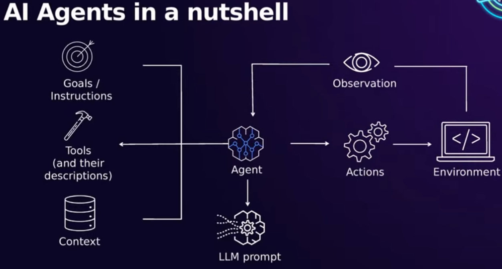
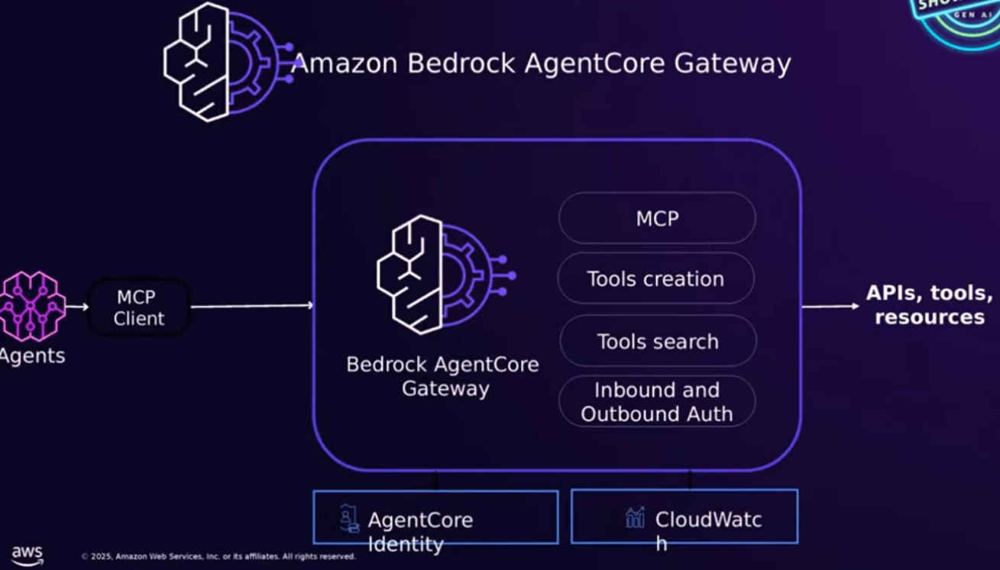
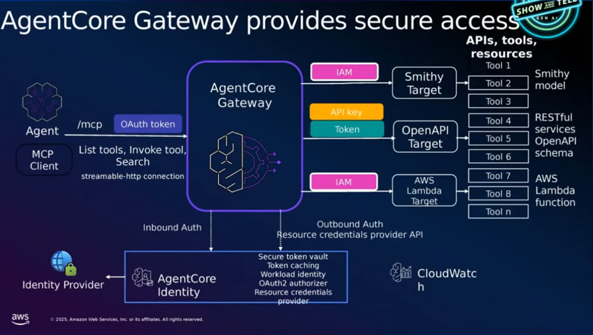

# Hosting MCP Servers & Agents on Amazon Bedrock AgentCore
### Runtime, Gateway, and Local → Cloud Workflows

---

# QR Code

  

---

# Agenda

1. Bedrock overview  
2. AgentCore concepts: Runtime, Identity, Gateway  
3. Why AgentCore (vs basic Bedrock calls)  
4. Local testing → production deployment  
- Hosting MCP servers & tools

<!-- 
This talk sets up the “why” behind AgentCore, then shows how Runtime and 
Gateway solve the real scaling, tooling, and security challenges customers face 
when moving from POCs into production. 

The notebook demo will cover configuration, deployment, and MCP server hosting
-->
---
# AI Agents in a nutshell

  

---

# What is Amazon Bedrock?

- Managed enterprise platform for building with foundation models  
- Provides model hosting, versioning, evals, and safety guardrails  
- Integrated features: Knowledge Bases (RAG), workflows, prompt mgmt  
- Secure, private deployment with no data leaving your AWS boundary

<!-- 
Bedrock is the *base layer* for modern AI applications.

AgentCore builds on top of this:
- Bedrock gives you the models, guardrails, evals, and RAG tooling, 
- AgentCore gives you the *runtime* for agents, tools, and MCP servers.
-->

---

# What is MCP (Model Context Protocol)?

- Open protocol for structured, tool-based interaction with LLMs  
- Standardizes how tools are described, discovered, and invoked  
- Defines transport (stdio / WebSocket / streamable HTTP) and message schema  
- Allows agents to call tools safely, consistently, and across ecosystems

<!--
Tools are NOT an AgentCore invention.  
MCP is the *cross-platform standard* for tool definition, discovery, input 
validation, and invocation.  

Why this matters:
- Bedrock models already understand tool-calling semantics  
- AgentCore uses MCP to guarantee reproducible behaviour across frameworks  
- Gateway converts APIs/Lambdas → MCP tools so agents can call them uniformly  
- Runtime expects MCP servers to speak MCP over stateless HTTP  

Position MCP as the “TCP/IP of agent tools”: the plumbing layer that makes the 
whole ecosystem interoperable.
-->

---

# MCP & Tools — How They Fit Together

- Tools are *functions*; MCP defines *how* those functions are exposed  
- MCP tools include: name, schema, description, parameters, return types  
- Agent frameworks (Strands, LangGraph, CrewAI) consume MCP tools consistently  
- AgentCore Runtime & Gateway rely on MCP contracts for compatibility

<!-- 
To settle any underlying confusion:
- Tools exist everywhere  
- But *MCP tools follow a protocol* that allows:
  - listing tools
  - invoking tools
  - validating input schemas
  - streaming results
  - long-running operations
  - secure authentication boundaries  

AgentCore Runtime hosts *your* MCP servers.

Gateway exposes *APIs* as MCP tools.

Both depend on MCP as the unifying standard abstraction layer.
-->
---

# The official benefits

  

---

# The Challenge: From POC → Production
- POCs are relatively easy: “vibe code” + local demos  
- Production is hard: security, auth, scaling, monitoring  
- Tools can multiply fast → M×N integrations  
- Multiple teams want to reuse tools safely

<!-- 
This is the key customer pain point: POCs feel magical, but production workloads need 
	- auth, 
	- auditability, 
	- scalability, 
	- governance, observability, and 
	- clean tool boundaries. 

This is a not inconsequential engineering task. Bedrock alone requires you to 
do this yourself. AgentCore makes this easier.

Bedrock features like knowledge bases, prompt management etc are still 
relevant. AgentCore builds on top of those existing tools
-->
---

# Introducing AgentCore
- Fully managed agent hosting platform  
- Components: Runtime, Identity, Memory, Gateway  
- Bring any framework, any model  
- Handles the undifferentiated heavy lifting

<!--
Released in July 2025 in Preview. Released GA in November 

The AWS pitch: “AgentCore exists to remove the undifferentiated heavy lifting: 
auth, scaling, compliance with MCP version changes, patching, observability, 
environment isolation, etc.”
-->

---

# AgentCore Runtime
- Serverless hosting for agents & MCP servers (and more)
- True session isolation (micro-VM per session, built on firecracker)  
- Supports streaming + async tasks out of the box, something Bedrock didn't 
  (long-running tasks up to 8 hrs)  
- Works with any Model and any agent framework

<!--
Highlight: Session isolation is a *hard* security boundary — each session runs 
in its own Firecracker micro-VM. This is far beyond typical container reuse in 
serverless. 

Also emphasize async tasks (e.g., long-running workflows like research 
or background batch jobs).
-->

---

# Key Runtime Benefits
- Zero infrastructure management  
- Deploy via CLI or SDK (configure → launch → invoke)  
- Only pay for active compute time  
- Automatic compatibility with observability stack

<!-- 
Runtime pricing is consumption-based; container cold starts are minimal; and 
CloudWatch GenAI Observability is integrated out-of-the-box.
-->

---

# The Gateway Problem (Pre-AgentCore)
- MCP servers require hand-built JSON-RPC plumbing  
- Managing OAuth inbound + outbound auth  
- Versioning, patching, scaling dozens of MCP servers  
- Hard to share tools across teams safely

<!-- 
This slide bridges to the Gateway: customers tried deploying many MCP servers 
manually and quickly hit the limits: auth, scaling, version upgrades, tool 
discovery, governance.
-->
---

# Introducing AgentCore Gateway
- Converts APIs, Lambdas, and services → MCP tools  
- Centralized, secure tool layer  
- Semantic tool search (avoid context blow)  
- Built-in OAuth for inbound + outbound access

<!--
Gateway is transformative: it “MCP-ifies” targets (OpenAPI spec, Lambda, Smithy) instantly. 
Outbound authorizers allow Gateway to call Slack, internal APIs, etc., using 
the correct (safely stored credentials. 

Semantic search reduces hallucinations and improves tool-selection accuracy.
-->

---
# AgentCore Gateway Overview 

  

---

# Why Gateway Matters
- Scale tools from 3 → 300+ safely  
- **Predictable Performance**: Reduce model performance degradation caused by tool 
  overload and context saturation
- **Governance**: control which clients use which tools  
- **Serverless**: unlimited gateways, pay per request

<!-- 
AWS’ vision: MCP becomes like TCP/UDP — plumbing no one thinks about.

Gateway is the part that makes MCP safe, scalable, and production-ready.
-->
---

# API vs MCP — When to Use Which

**Use API directly when:**
- Deterministic, simple request/response  
- No tool orchestration needed  

**Use MCP (via Gateway) when:**
- You want tool discovery & semantic matching  
- You want agents, not developers, choosing tools  
- You want standardized contracts across teams

<!--
Gateway doesn't replace APIs. It exposes them to agents in a standardized MCP 
protocol. 

Tools become reusable internal “primitives” instead of one-off API 
integrations.
-->

---

# Local Development Workflow
- Run Strands / LangGraph agents locally  
- Test tools with MCP Inspector  
- Deploy to Runtime when stable  
- Same code, zero changes required

<!--
local testing uses streamable HTTP or stdio. Deployment just wraps 
your agent entrypoint with the AgentCore SDK and ships it as a container.
-->

---

# Deploying to Runtime (High-Level Steps)
1. `agentcore configure`  
2. Autogenerate Dockerfile  
3. Build → ECR → Runtime endpoint  
4. Invoke with CLI / SDK / app

<!-- 
In the notebook demo I'll show the entire flow: configure, launch, status 
polling, then invoking through Bedrock APIs.
-->
---

# Hosting MCP Servers on Runtime

- Python FastMCP or TypeScript MCP supported  
- Stateless HTTP mode for cloud scaling  
- Deploy like any Runtime agent  
- Test via MCP Inspector or remote client

<!-- 
Runtime hosts *your MCP server* (not just AgentCore Gateway). This is ideal for 
custom tools that aren’t expressible as OpenAPI specs.
-->

---

# Authentication (Inbound & Outbound)
- Inbound: validate JWT/OAuth tokens  
- Outbound: securely call external APIs  
- Supports Cognito, Auth0, Okta, etc.  
- Credentials stored & rotated automatically

<!--
This solves a HUGE pain: before, every MCP server needed its own auth 
implementation.

Gateway and Runtime unify this, consistently and securely, abstracting away 
the pain of complex authentication work.
-->

---

# Authentication Workflow

  

---

# Semantic Tool Search & Lazy Loading
- LLM queries tools by meaning, not raw names  
- Lazy loading: tools are fetched only when relevant  
- Prevents context saturation from large tool libraries  
- Improves accuracy & reduces hallucination

<!-- 
Lazy loading is critical in large orgs with 100–500 tools.  
Without lazy loading, all tool definitions get injected into 
the model context → token bloat, latency spikes, degraded 
performance. Semantic search + lazy loading together ensure 
the model only "sees" tools that matter.
-->

---
# Common Pitfalls

- Too many tools loaded eagerly → context saturation  
- Missing or vague tool descriptions → poor matching  
- Agents may forget to call tools without scaffolding  
- No lazy loading = degraded performance & higher cost

<!-- 
If an org eagerly loads all tools, performance tanks and 
models hallucinate. Gateway + lazy loading solve this by 
only surfacing relevant tools at runtime.
-->

---

# Testing Strategies
- Local MCP Inspector  
- Local Runtime via `--local` flag  
- Cloud: low-cost invocations  
- Use CloudWatch GenAI Observability for traces

<!--
This reassures beginners that cloud testing is not expensive. Also mention that 
traces allow them to see agent → tool → model behaviour step-by-step.
-->

---

# Costs & Practical Considerations
- Runtime: pay only for active compute time  
- Gateway: no charge for gateways; requests only  
- Model inference: standard Bedrock pricing  
- Easy to scale down (serverless everything)

<!--
Customers love the fact that cost correlates directly with usage. No idle 
servers.
-->

---

# Putting It All Together
- Build locally (Strands / LangGraph / MCP)  
- Test MCP tools locally  
- Deploy agents & MCP servers to Runtime  
- Expose enterprise APIs via Gateway  
- Use semantic search + OAuth for production safety

<!--
The “mental model” summary slide.
-->

---
# Production architecture

  

---

# Workshop Flow
- Part 1: Presentation (this deck)  
- Part 2: Notebook demo  
  - Configure Runtime  
  - Deploy agent  
  - Deploy MCP server  
  - Test via MCP Inspector & remote client  
  - Explore Gateway concepts

<!--
Set expectations: the notebook does the hands-on heavy lifting.
-->
---

# Q&A
Ask anything about Runtime, Gateway, MCP, deployment, auth, or real-world use cases.
